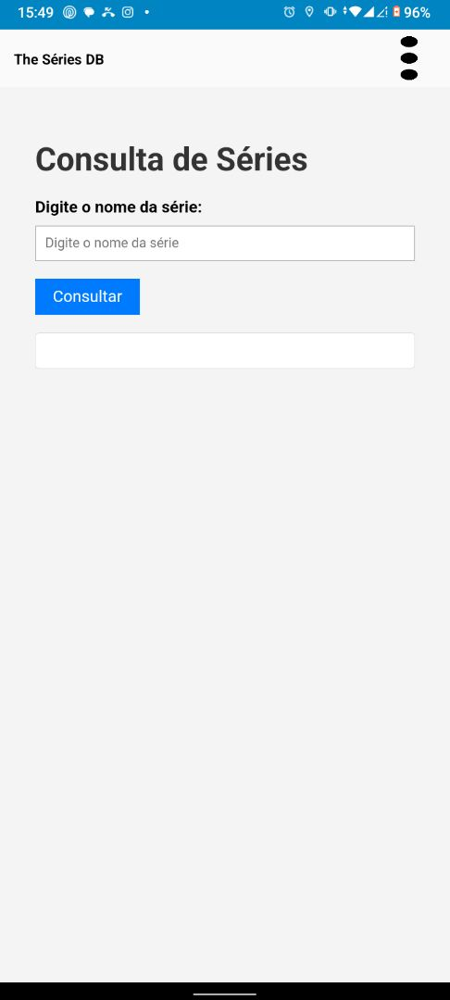

# The TMDB Séries

## Descrição do Projeto

**The TMDB Séries** é uma aplicação desenvolvida para consultar séries de TV utilizando a API do The Movie Database (TMDB). Esta aplicação permite aos usuários pesquisar informações detalhadas sobre séries de TV, incluindo sinopse, elenco, temporadas, e episódios. Além disso, a aplicação inclui um player integrado para assistir a trailers e outros vídeos relacionados às séries.

---

## Funcionalidades Principais

1. **Pesquisa de Séries**: Permite aos usuários buscar por séries de TV usando títulos ou palavras-chave.
2. **Detalhes da Série**: Exibe informações detalhadas sobre as séries, incluindo descrição, elenco, temporadas e episódios.
3. **Player Integrado**: Inclui um player para assistir a trailers e outros vídeos disponíveis.

---

## Tecnologias Utilizadas

- **Linguagem**: Português
- **API**: TMDB (The Movie Database)
- **Front-end**: HTML, CSS, JavaScript
- **Player de Vídeo**: Video.js ou qualquer outro player de vídeo compatível
- **Autenticação de Usuário**: JWT (JSON Web Token)

---

## Fluxo de Funcionamento

1. **Tela de Pesquisa**: O usuário digita o nome ou palavra-chave da série desejada.
2. **Resultados da Pesquisa**: A aplicação exibe uma lista de séries correspondentes.
3. **Detalhes da Série**: Ao selecionar uma série, o usuário é redirecionado para a página de detalhes.
4. **Player de Vídeo**: Na página de detalhes, o usuário pode assistir ao trailer ou outros vídeos disponíveis.

---

## Requisitos

- **Chave de API TMDB**: É necessário obter uma chave de API do TMDB para utilizar os serviços.
- **Conexão à Internet**: A aplicação necessita de conexão para consultar a API do TMDB.

---

## Capturas de Tela

### Tela de Pesquisa

### Resultados da Pesquisa

### Detalhes da Série

